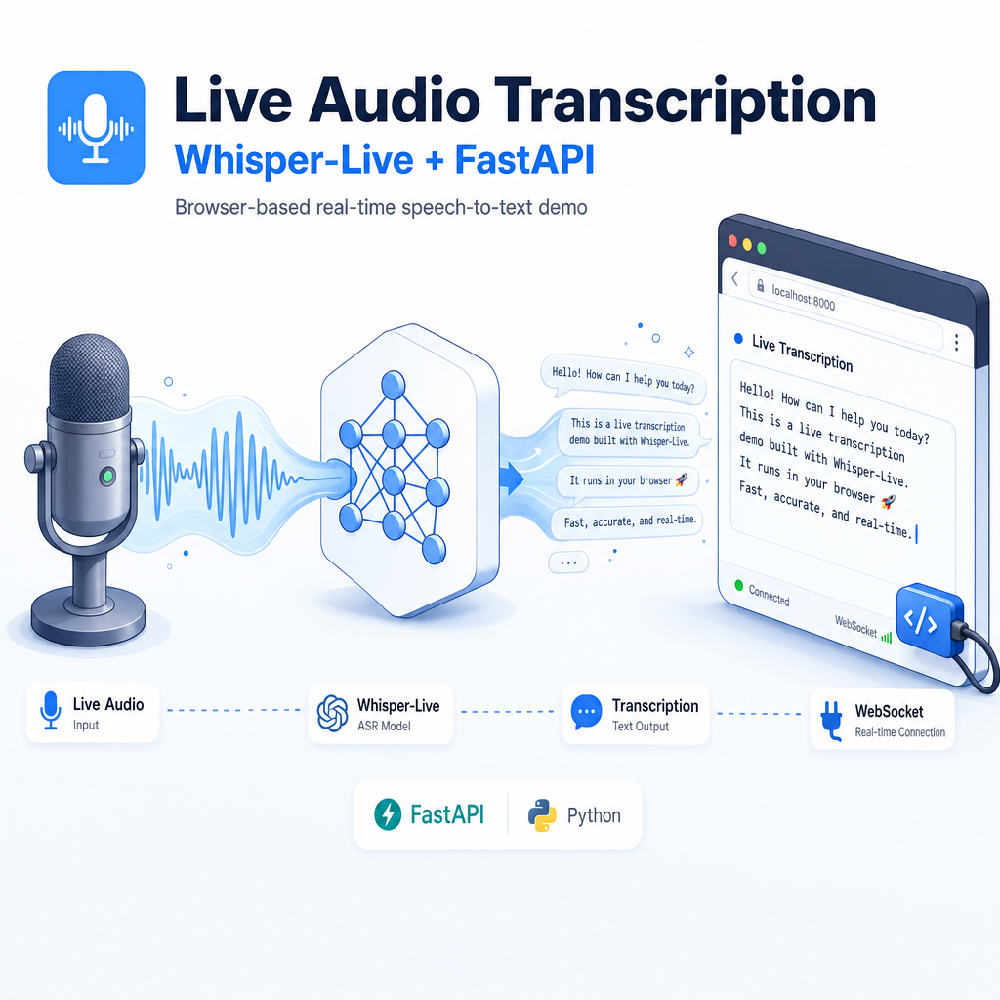

# liveListenWhisper

A thin wrapper around WhisperLive that exposes both a Python terminal client and a browser-based live-transcription demo. Stream audio from your microphone over WebSocket to a running WhisperLive server and get real-time transcriptions.

## What's inside

- `run.py` — Python terminal client using `whisper_live.client.TranscriptionClient` with automatic version compatibility for the model constructor argument
- `fastapi_main.py` — Tiny FastAPI server that serves `index.html` and `whisperlive-client-standalone.js` over HTTPS (port 8001)
- `whisperlive-client-standalone.js` — Standalone browser client that streams audio over WebSocket and receives live transcriptions
- `demo.html` — Browser demo page with UI for configuring and starting transcription

## Prerequisites

You need:

1. A running WhisperLive server (the Python client defaults to host `100.88.83.27` port `9090`; adjust the server endpoint as needed)
2. For the FastAPI demo server: `cert.pem` and `key.pem` in the project root to serve HTTPS

See the [WhisperLive GitHub repository](https://github.com/collabora/WhisperLive) for instructions on running the WhisperLive server.

## Run (Python terminal client)

```bash
pip install whisper-live
python run.py
```

Or use the shell launcher:

```bash
./run.sh
```

## Run (Browser demo)

```bash
pip install fastapi uvicorn
python fastapi_main.py
```

Then open `https://localhost:8001/` in your browser.

## Notes

The WebSocket URL is hardcoded in the JavaScript client. Edit the host and port configuration in `whisperlive-client-standalone.js` (constructor options) or in the browser UI to point to your WhisperLive deployment.
